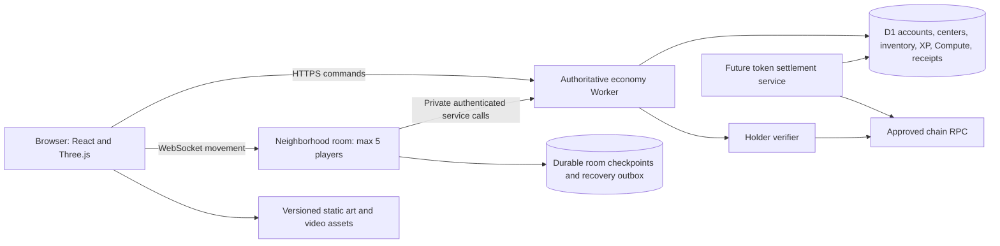

# Noobius: game design, multiplayer and production research

Research date: 20 September 2026. This is a design and engineering decision record, not a claim that public multiplayer, token settlement or retention has been demonstrated. No deployment, token transaction or production-data migration was performed in this pass.

## Decision

Build a **persistent multiplayer data-center tycoon with skill-based RPG progression and a player economy**. Keep the center as the player's durable home. Use small shared neighborhoods, each with five players and their private interiors. Realms describe different activities and admission rules; each realm can contain many neighborhoods. A room is a live server instance, not a different copy of the entire player's account.

The durable loop is preparation → useful work → resources and earned expertise → a new capability → a choice about where to use the result. A timer, a larger number, or a token gate alone does not make that loop interesting. Owning the last machine must open productive options rather than end the game.

Keep existing React/Three.js, the authoritative economy service and SQL persistence. Continue the existing room coordinator rather than replace the game engine. Host the eventual production runtime in an owner-controlled Cloudflare account, with private service communication. Colyseus Cloud is the fallback if maintaining our room code proves more costly than integrating a managed room framework. Hosting is deliberately a later acceptance stage.

## Kintara: what we verified

Kintara is an isometric browser RPG/MMO: gathering, skill training, crafting, equipment, exploration, combat and player markets. Its token is **KINS on Solana**. Resources, internal gold, wallet KINS and deposited in-game KINS are separate assets. Gathering a rock does not mine blockchain tokens. [Official guide](https://kintara.com/#docs), [How to Play](https://kintara.com/#how-to-play)

Its August 29 release permits free play to displayed Total Level 10. Holding 1,000 KINS removes that cap and enables designated biomes; some outward-value actions require a 24-hour hold. That is an earned progression system plus an entitlement, not an escalating token-price ladder for every world. [v5.9](https://kintara.com/news?id=35&kind=update)

The shipped client calculates displayed Total Level from the floored average of fractional levels in the five original skills; Smithing is a sixth skill but is excluded from that calculation. Current entry constants include Glade Cave at 20 and Emberstone at 25, while Shores and Dunes entry are 1. Species, equipment and other conditions still matter. These are client observations, not authenticated tests of every server gate. [Current game bundle](https://kintara.com/game.js), [constants](https://kintara.com/src/constants.js)

A separate August holdings ladder gives name colors and small XP boosts at 1,000 through 5,000,000 KINS. Other thresholds grant storage/listing perks after a holding period. The published policy preserves contents when extra storage locks after eligibility loss. Do not confuse those benefits with character levels. [v5.8](https://kintara.com/news?id=34&kind=update)

The useful production structure is interdependence: ore and coal become ingots, then equipment; fish can become bait for another species or food. Tools have durability, higher equipment affects work, and several activities consume the same goods. August's fishing update documents Herring 1, Trout 6, Bass 13 and Tuna 20; September adds deeper offshore content. [Smithing update](https://kintara.com/news?id=29&kind=update), [fishing overhaul](https://kintara.com/news?id=33&kind=update), [v6.0](https://kintara.com/news?id=36&kind=update)

The public server endpoint showed 15 selectable entries across North America, Europe and Asia Pacific, including three Club entries. All showed a minimum-level field of zero. A dated regional release describes session ownership and coordinated handoff. These establish selectable worlds and routing behavior, not 15 physical machines or a measured concurrency capacity. [Server list](https://kintara.com/api/servers), [regional update](https://kintara.com/news?id=25&kind=update)

The public browser assets establish JavaScript ES modules, Three.js/WebGL, HTTP APIs, WebSockets and Solana wallet integrations. Cloudflare response headers establish an edge provider. **The origin hosting vendor, database engine, server implementation, full save architecture, fleet cost and retention cohorts were not established.** We should not label a guessed Node/Postgres/Cloudflare diagram “Kintara's backend.” [Play shell](https://kintara.com/play), [client configuration](https://kintara.com/client-config.js), [server selector](https://kintara.com/src/client/server-select.mjs)

### Economic corrections that matter for Noobius

- A player can list gold or items for KINS, but a sale needs another buyer. This is not a guaranteed gold-to-token redemption rate. The observed token checkout consumes a server quote and constructs token transfers. That alone does not prove atomic database fulfillment. [Marketplace documentation](https://kintara.com/site/js/components/docs.js), [payment module](https://kintara.com/marketplace-token-wallet.mjs?v=20260905-pfee1)
- Older marketplace copy gives a 2.5% treasury / 2.5% burn split. The August 29 update instead specifies 95% seller / 5% treasury / zero burn, with referral sharing. Do not reproduce the stale fee comment. [Current dated policy](https://kintara.com/news?id=35&kind=update)
- September's release adds deposited KINS, withdrawals with a stated 1% fee, and deposit balances counting toward holdings. A non-custodial login wallet and later custodial deposits can coexist; they are different layers. Custody controls, reserves and solvency were not audited. [v6.0](https://kintara.com/news?id=36&kind=update), [deposit module](https://kintara.com/kins-deposit-wallet.mjs)
- The old resource-bundle-to-gold merchant is historical. July closed it, and the current public state reports gold trading disabled. It is unsuitable as the blueprint for a supposedly live perpetual faucet. [Merchant closure](https://kintara.com/news?id=19&kind=update), [current merchant state](https://kintara.com/api/world/merchant-campaign)

Research used current public client/API evidence, dated official releases, then undated guides in that order. Older wiki/repository/search snippets were leads, not authority. No game account, wallet connection, payment or private server was used. Release activity and displayed population labels do not establish economic sustainability or human retention.

## What other games teach us

| Primary reference | Relevant documented structure | Noobius design implication |
| --- | --- | --- |
| [Sunflower Land farming](https://docs.sunflower-land.com/player-guides/farming-guide) | Tools, cooking, feed, bait and later machinery connect resource chains | Every realm output should have several useful destinations in the existing center economy |
| [Sunflower chapter quests](https://docs.sunflower-land.com/player-guides/chapter-quest) | Short tasks feed longer chapter goals; acquired collectibles persist | Later seasons can rotate challenges without deleting permanent player progress |
| [Sunflower economy](https://docs.sunflower-land.com/project/economy-tokenomics) | FLOWER spending/recycling model; current docs supersede old SFL/Polygon copy | Count currency creation, transfer and destruction separately; operator claims are not solvency evidence |
| [Sunflower fair play, Aug 2026](https://docs.sunflower-land.com/support/terms-of-service/prohibited-conduct) | Automation, feeder accounts and wash trading are distinct abuse concerns | Correct signatures and balances do not prove a human player; preserve reviewable evidence |
| [Pixels task board](https://help.pixels.xyz/en/articles/9165794-what-is-the-task-board) | Orders expose goods, quantities, payment and XP; token-paying tasks are not guaranteed | Show actual commitments before acceptance, and keep ordinary progression reliable |
| [Pixels retrospective](https://litepaper.pixels.xyz/usdpixel-whitepaper/lessons-learned-and-revised-vision) | The operator describes emission and extraction problems | More cash rewards do not fix shallow play; test mature-player consumption and repeat demand |
| [Pixels marketplace](https://help.pixels.xyz/en/articles/7830138-how-do-i-access-the-marketplace) | A market station and eligibility rules | Display unit price, quantity, total and net proceeds; never invent fills or liquidity |
| [Pixels reputation](https://help.pixels.xyz/en/articles/8602409-what-is-pixels-reputation) | Account trust/access score is separate from skill work | Label commercial access, trust and earned level separately |
| [Pixels VIP, Aug 2026](https://help.pixels.xyz/en/articles/11782159-vip-tiering-system) | Spending-based status can decay | A holder benefit is an entitlement; permanent earned XP should not disappear when holdings change |
| [RuneScape skills](https://www.runescape.com/game-guide/skills) | Activity XP unlocks activities, equipment and places | Make level unlocks functional and previewable, with ordinary materials retaining value |
| [OSRS bonds](https://www.runescape.com/oldschool/bonds) | Tradable membership entitlement | Market exchange requires a counterparty; it is different from operator cash redemption |
| [OSRS economy update, May 2025](https://secure.runescape.com/m=news/yama-cas--more?oldschool=1) | Tax change responds to issuance/removal imbalance; existing offers retain terms | Measure before choosing fees; currency sinks and item sinks are different; freeze accepted terms |
| [RuneScape market page](https://secure.runescape.com/m=itemdb_rs/Rocktail/viewitem?obj=15272) | Price history and traded-volume context | Separate asking prices from completed sales; thin markets should say there is insufficient data |
| [Eco work parties, Mar 2020](https://store.steampowered.com/news/posts/?appids=382310&enddate=1586284194&feed=steam_community_announcements) | Asynchronous collaboration around actual production needs | Service, fabrication and machine-time contributions should all matter to shared projects |
| [Axie economic balancing, Feb 2022](https://blog.axieinfinity.com/p/upcoming-season-20-and-economic-balancing) | Operator response to reward issuance greatly exceeding consumption | An indefinitely repeatable activity and indefinitely fundable payouts are separate problems |

Dates matter: some reference guides are historical, especially Pixels reputation and Eco's work-party announcement. These are structural lessons, not assertions of current exact feature parity or causal proof of retention. RuneScape and OSRS are separate rule sets. Current Sunflower documentation describes FLOWER/Base; older SFL/Polygon snippets were excluded.

## Noobius audit: strengths and shortcomings

The existing repository already contains real foundations: guest/account separation, persisted facility state, optimistic concurrency, atomic purchases and internal player escrow, three job families, batch fabrication, rack capacity reservations, typed project contributions, cooperation, holder revocation and a substantial local room coordinator. A rewrite would discard valuable correctness work.

The weakness was the connection between these systems. Before this pass, player XP stopped producing rank milestones at 600, public “level” came from a different reputation score, and the guide advertised obsolete production rates. A deterministic audit following the automatic objective every 15 seconds reached the complete purchase ladder in approximately 177 simulated minutes with zero client jobs. That is a simulation of one guidance path, not a human duration or fastest strategy. It supports the user's complaint that buying everything can become the game.

| Priority | Finding | Resolution or remaining work |
| --- | --- | --- |
| Now | Several meanings of “Level” | One earned player level; reputation retains a distinct label |
| Now | Worlds mainly differ by presentation/project access | Four realm destinations now have repeatable recovery activities with distinct diagnostic types and useful material outputs |
| Now | Unlimited-looking UI could claim money | Compute remains game money; real token checkout remains absent |
| Now | Old guides disagree with rules | Machine-capacity and boost tables read actual constants |
| Now | New work can create replay/save/access-loss bugs | New tests cover run identity, timers, reloads, repeated claims, level gates and paid-work recovery |
| Next | One ordinary computing offer can underuse a large center | Add competing workload orders, slot limits and frozen reservations in a separate authoritative change |
| Next | Finite upgrades stop absorbing Compute | Field preparation adds optional recurring spending; simulate it before claiming balanced mature demand |
| Next | Utility purchases describe benefits no longer enforced | Remove from exposed choices or implement a real supported benefit; do not silently add costs to existing machines |
| Next | Many menus and concepts compete for attention | Uncoached player tests; measure missed actions, unclear terms, idle time and voluntary next choices |
| Before money | Browser saves and visible puzzle answers can be automated | Guest progress must never become transferable value; add accountable issuance, limits and abuse review before cash markets |
| Before scale | HTTP polling and frequent checkpoint writes can dominate cost | Hosted socket integration, load measurements and write-budget tuning |

The new realms are a playable foundation, not proof of a finished MMO. They reuse the existing bounded neighborhood layout and diagnostic systems. Large bespoke maps, additional challenge families, seasonal content, deeper specialization and measured long-term balance remain work. Player XP can keep growing after the final current realm unlock; that does not imply infinite unique content.

## Proposed data and multiplayer architecture

| State | Home | Rules |
| --- | --- | --- |
| Rendering, animation, interpolation | Browser memory | Presentation only; never proof of rewards |
| Guest progress | Browser storage | Solo practice, no account-value import |
| Identity/session, XP, center, items, Compute | D1 behind economy API | Owned server state; validated commands and conditional commits |
| Live players and movement | One Durable Object per neighborhood | Five admitted players, scene-specific public broadcasts |
| Recovery obligations | DO storage and D1 receipts | Durable until reconciliation succeeds |
| Art, video and textures | Versioned static hosting / R2 where useful | Public assets, cacheable, no secrets |
| Holder evidence | D1 entitlement cache | Exact policy, asset and block/slot evidence, bounded expiry |
| Real token balances | Blockchain | Separately verified; not inferred from UI or local saves |

No server has to tick every offline rack. Reconcile capped production lazily from persisted server timestamps on return or mutation. Never accept a browser-supplied balance, duration, loot table or new level. The new field system freezes its cost/result at start so later tuning cannot change an already paid run.

Commands need idempotent identity and immutable terms. Balance/version checks and dependent receipt writes must succeed together. A database transaction that affects zero rows is not automatically an error; dependent writes must be guarded. [D1 transaction semantics](https://developers.cloudflare.com/d1/worker-api/d1-database/)

Movement is different from economy. Keep compact input/deltas in the room and render smoothly between updates. Persist deliberate checkpoints and worksite evidence rather than writing every rendered frame to SQL. The existing coordinator includes single-use tickets, session/controller fencing, short writer leases, checkpoint receipts, an outbox and action-payload proofs. Those systems exist locally; hosted socket readiness remains unproven.

Reconnect obtains a new authorized snapshot, rejects stale generations and reconciles pending commands using their original IDs. Do not replay old walking input or charge again because an HTTP reply was lost. Five private interior scenes can share the same neighborhood authority while filtering broadcasts by scene. An offline owner keeps the center in SQL; visitors cannot keep a departed owner's private scene indefinitely.

## Hosting choice and realistic costs

| Option | Why use it | Cost/migration boundary |
| --- | --- | --- |
| Cloudflare Workers + D1 + existing room coordinator | Preserves current code, state and race protections | Recommended; provision owner environments and private ingress, then measure workload |
| Colyseus Cloud | Managed room hosting if custom networking becomes a burden | Advertised from $15/month; requires protocol/auth/economy integration; finite compute despite no CCU tariff |
| Nakama / Heroic Cloud | Broad account/social/live-service platform | Larger runtime and storage migration; no reliable public Nakama minimum was verified |
| PartyKit / PartyServer | Room-library ergonomics on Cloudflare | Own-account operations still required; hosted free storage is unsuitable for permanent saves |

Sources: [Colyseus pricing](https://colyseus.io/pricing/), [Colyseus scaling](https://docs.colyseus.io/scalability), [Nakama authoritative matches](https://heroiclabs.com/docs/nakama/concepts/multiplayer/authoritative/), [Heroic pricing](https://heroiclabs.com/pricing/), [PartyKit](https://www.partykit.io/), [PartyServer](https://github.com/cloudflare/partykit/blob/main/packages/partyserver/README.md).

Workers Paid starts at $5/month, but that is not a game hosting quote. Active room-hours, message rate, SQL/index writes, logging and chain RPC determine the total. An illustrative 30-day model with five players/room, 6.25 movement messages/second/player and one room alarm/second gives base plus DO request/duration costs of about $5.75 for 50 concurrent players used two hours/day, or $517.10 for 500 used continuously. **Both exclude Workers API/CPU overages, storage operations, D1, RPC, logs, backups, domain and staging.** They assume otherwise unused included quotas and current billing rounding. [Workers pricing](https://developers.cloudflare.com/workers/platform/pricing/), [DO pricing](https://developers.cloudflare.com/durable-objects/platform/pricing/)

D1 primary execution is single-threaded and Paid databases have a 10 GB limit. Checkpoints every five seconds already imply ten checkpoint operations/second at 50 active players, before counting statements, indexes and separate authority refreshes. Measure database time and rows, not just socket count. [D1 limits](https://developers.cloudflare.com/d1/platform/limits/), [D1 pricing](https://developers.cloudflare.com/d1/platform/pricing/)

The current coordinator's periodic alarms and in-flight work mean hibernation savings cannot be assumed. Browser session cookies and hosting bypass credentials are not service credentials. Owner-account Worker service bindings provide a suitable private path; the present private app host needs supported machine ingress or a planned runtime migration. Choosing another socket vendor does not solve that boundary. [WebSocket hibernation](https://developers.cloudflare.com/durable-objects/best-practices/websockets/), [service bindings](https://developers.cloudflare.com/workers/runtime-apis/bindings/service-bindings/)

Keep the pinned, currently tested Vinext version during this rollout; framework migration and multiplayer launch should not be the same change. Its upstream capabilities and limitations need their own upgrade review. [Vinext](https://github.com/cloudflare/vinext)

## Token access and eventual Compute sales

The intended Noobius market is **seller's earned Compute → buyer pays real $NOOBIUS → buyer receives Compute**. It is peer-funded trade, not a promise that the treasury buys all Compute. Current item-for-Compute escrow is useful groundwork but is not that settlement system.

Choose one exact chain, contract/mint, decimals, threshold, confirmation policy and RPC provider. The example “10,000 tokens” is not a production configuration. Existing EVM verification is configurable and fails closed when unconfigured. Solana login exists, but a Solana holder adapter does not. Never substitute a symbol or a connected wallet for verified ownership. Authentication and holdings are separate checks. [SIWE](https://eips.ethereum.org/EIPS/eip-4361), [Ethereum RPC](https://ethereum.org/developers/docs/apis/json-rpc/), [Solana token-account queries](https://solana.com/docs/rpc/http/gettokenaccountsbyowner)

Recommended policy: earned levels are permanent; holder eligibility is renewable; loss of eligibility stops new privileged work while preserving property and already paid work. Cached entitlement must have bounded expiry and outage grace. Whether staked/LP/custodial holdings count, and whether a minimum holding period applies, are explicit product choices. A simple wallet balance check does not prevent temporary borrowing or prove a unique human.

Real settlement requires a separately reviewed protocol:

1. Reserve seller Compute and write immutable listing terms atomically.
2. Bind one buyer and one trade identity to the reservation.
3. Verify finalized escrow funding independently of the browser.
4. Serialize on-chain acceptance against refunds before allowing delivery.
5. Credit buyer Compute once, consume the reservation and record the release obligation in one database transaction.
6. Release seller payment once; reconcile uncertain transactions instead of sending a fresh payment.
7. Recover crashes, reorgs, expiry, cancellation and manual-review cases from durable receipts.

A chain cannot independently know that an off-chain SQL credit occurred. Operator authority and recovery obligations remain. A timeout refund racing a delivered Compute credit is a critical failure case. Database restores do not rewind blockchain transfers. Isolate signing authority, bound outstanding exposure and test with test assets before any real-value flow. Queues can deliver work more than once, so they cannot replace deduplicated receipts and a reconciliation ledger. [Cloudflare Queue delivery](https://developers.cloudflare.com/queues/reference/delivery-guarantees/), [Solana status lookup](https://solana.com/docs/rpc/http/getsignaturestatuses)

## Ordered delivery plan

1. **Gameplay acceptance:** finish local realm flow and old-save protection, then run uncoached new/mature/return sessions. A player should explain two worthwhile actions, choose one for a reason, finish it, and identify the next goal. Evaluate repeated sessions, not feature count.
2. **Economy iteration:** simulate resource creation/consumption and Compute issuance/sinks for fresh and maxed players. Add competing client orders and desirable recurring uses based on findings. Separate real player transfers from currency creation. Preserve accepted terms.
3. **Isolated staging:** owner-controlled app/economy, D1, room namespace, secrets, origins and approved private ingress. Keep socket admission off initially. Separate staging data and token configuration physically from production. [Wrangler environments](https://developers.cloudflare.com/workers/wrangler/environments/)
4. **Five-person hosted alpha:** real browsers, phones and wallets; five-player admission, sixth-player handling, scene visits, trade, logout, sleep, reconnect, holder loss and ten-minute-plus grant renewal. Restart the host during pending work and inspect balances/receipts.
5. **Measured load:** begin with ten rooms/50 clients plus rendered clients; then expand toward 500 only with recorded headroom. Proposed targets: same-region command p95 under 500 ms, reconnect under two seconds, no unbounded queues or duplicate rewards. These are targets, not current results.
6. **Recovery rehearsal:** export and restore into an isolated environment; drain/revoke writers and reconcile outboxes. D1 Paid Time Travel offers up to 30 days, but backup availability is not a successful recovery drill. Record recovery time and tolerated loss. [D1 Time Travel](https://developers.cloudflare.com/d1/reference/time-travel/)
7. **Operational release:** commit/versioned artifact, additive migrations, staged rollout, admission cap, spend alerts, named operator, moderation and incident controls. Verify protocol compatibility before any rollback; do not remove writer fences while room writers are active. [Workers gradual deployments](https://developers.cloudflare.com/workers/versions-and-deployments/gradual-deployments/)
8. **Optional real-token marketplace:** final asset and fee policy, reviewed escrow/reconciliation, funding/delivery/refund tests, signer ownership, monitoring and bounded rollout. No real payout claim until demonstrated end to end.

Before hosted work, we need the launch concurrency/regions and budget, confirmed owner account/data ownership, supported wallet scope, and an operational owner. Free-realm staging can proceed with holder access disabled. The exact token policy is required before holder-gated admission; settlement terms are required before real-token trading. The peer-funded market direction is already established. Those choices do not block the local gameplay work delivered with this report.
