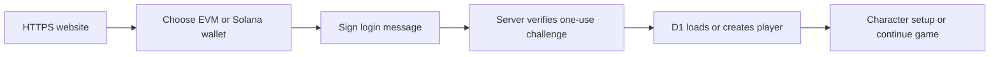

# Noobius: website and wallet launch checklist

Updated September 8, 2026. First milestone: a visitor opens an HTTPS website, signs in with Ethereum/EVM **or** Solana, enters the existing game, and returns to the same saved progress. A Cloudflare-managed custom domain will follow once purchased.

## What exists and what changed

The [GitHub repository](https://github.com/ak-1080/noobius/tree/a732ec1e8bb85111dbff17d548a5e79996859c5e) already contains a browser game, a server API and persistent accounts: React/Three.js, vinext on a Cloudflare Worker, and D1. This needs a server-backed deployment; uploading static files alone would omit authentication and saves.

The existing [hosted address](https://noobius-compute-crew.rivd609.chatgpt.site/) is active but has owner-only hosting access. The initial inspection found latest saved version 27, no custom domain, and a 401 response for an unauthenticated visitor. Opening this hosting gate and authenticating a game account are separate steps.

The implementation prepared in this pass adds:

- **Connect wallet & play** as the main entry action, with a clearly separate guest option.
- Ethereum/EVM and Solana tabs. EVM retains EIP-6963/injected-provider discovery; Solana uses Wallet Standard providers supporting message signing.
- Server verification of Solana Ed25519 signatures against the exact issued challenge, alongside the existing EVM flow. Challenges expire after five minutes and can be consumed once; app sessions last seven days and use HttpOnly cookies with hashed tokens in D1.
- Separate internal account keys for each ecosystem. Solana addresses retain their case. Existing EVM save keys and facility identifiers are preserved; new Solana players receive opaque public facility identifiers.
- Direct entry into the existing character setup/game after sign-in, cancellation recovery and account-change checks before and after verification. A valid saved session survives an initially empty extension account list on reload; later account-change/disconnect events still invalidate it.
- One additive database migration, `0004_odd_blackheart.sql`, adding a nullable unique public identifier. Existing player records are retained.

Ethereum and Solana accounts are separate saves, even when both are in Phantom. Linking two wallets to one player is future work. Guest progress stays in that browser/origin and does not currently transfer to a wallet account.

Login is an off-chain proof of wallet control: no token purchase, gas, NFT or spending approval is needed. The app never asks for seed phrases or private keys. [SIWE specification](https://eips.ethereum.org/EIPS/eip-4361), [Solana message signing](https://docs.phantom.com/solana/signing-a-message)

## What Kintara contributes

Kintara's [How to Play page](https://kintara.com/#how-to-play) and public frontend provide a useful entry pattern: prominent connection, a signed challenge, first-time naming, then restoration for returning players. Its wallet path uses Solana; similarly named wallet brands do not imply EVM authentication. [Authentication source](https://kintara.com/src/auth-gate.js?v=20260903-brave1), [wallet registry](https://kintara.com/src/wallet-registry.mjs?v=20260828-privy-tier)

Kintara also implements email access through an embedded Solana wallet and a spectator path. Those are optional later features for Noobius. Its guide and free-play configuration conflict on token access; that behavior should not be copied as an established requirement. [Public configuration](https://kintara.com/client-config.js), [email implementation](https://kintara.com/src/privy-login-ui.mjs?v=20260905-pfee1)

Evidence limit: the guide and public frontend were reviewed. No Kintara account was created or wallet message signed, and authenticated/token-gated access was not verified.

## Player journey

1. Open the website and select **Connect wallet & play**.
2. Choose Ethereum/EVM or Solana, then an installed supported wallet.
3. Approve a readable message showing the site's domain and login purpose.
4. The server verifies the signature and creates or loads the wallet's account.
5. New players set a name/appearance once. Returning players continue their game.
6. Reload or sign in later with the same account to recover saved progress.

## Launch checklist, in order

| Status | Step | Owner | Completion evidence |
|---|---|---|---|
| Done | Choose Ethereum/EVM and Solana | Team | Both selected for the first release |
| Done | Inspect existing hosting and account storage | Web developer | Existing Site, Worker API and D1 confirmed |
| Done | Implement both wallet paths and entry flow | Web developer | Separate providers, signature verification and account namespaces |
| Done | Preserve existing accounts and add schema migration | Web developer | Existing EVM IDs retained; schema-only migration added |
| Done | Run automated local validation | Web developer | Verification record below |
| Pending | Publish validated code to the existing owner-private Site | Web developer | Successful deployment and hosted HTTP smoke check |
| Pending | Accept actual wallet/browser behavior on HTTPS | Team/testers | Manual matrix below completed for each advertised wallet |
| Pending | Select public or limited tester audience | Product owner | Explicit audience choice, then hosting access update |
| Pending | Verify entry from outside the owner's hosting account | Tester | Page opens, wallet signs in, save survives reload |
| Pending | Confirm operational basics | Web developer | Error visibility, DB recovery path, compatible rollback |
| Later | Attach Cloudflare-managed domain | Owner + web developer | Domain registered, host verified, HTTPS and wallet-domain checks pass |

Use the existing hosted address for the initial alpha. Domain registration does not require replacing the hosting stack. Keep frontend and API on the same origin, and use a separate D1 database for test environments.

## Actual-wallet acceptance matrix

Automated cryptographic tests do not prove extension dialogs or browser cookie behavior. Begin with desktop Chrome plus MetaMask on EVM and Phantom on Solana; add Rabby/Solflare or other browsers only after they pass this same matrix. These are proposed acceptance targets, not claims that every listed extension has been tested.

- [ ] Installed wallet appears under the correct ecosystem; an absent wallet has a useful install/help path.
- [ ] Wallet displays the correct HTTPS hostname and a login message, with no transaction/spending request.
- [ ] Cancel connection/signature, recover, then successfully log in.
- [ ] First login creates one character; repeat login does not repeat setup.
- [ ] Change appearance or build/upgrade, reload, and recover the same progress.
- [ ] Sign out, sign in again, and recover the same facility.
- [ ] Change wallet account during and after login; no account can modify another account's save.
- [ ] Return with a valid app session, including when the extension initially exposes no accounts.
- [ ] Expired session returns to a usable sign-in flow.
- [ ] Test both ecosystems in the same browser and confirm that their saves remain separate.

WalletConnect QR pairing, EVM contract-wallet verification and embedded email wallets are not implemented. Mobile requires separate wallet-browser/device acceptance before being advertised.

## Cloudflare domain checklist

- [ ] Buy the intended domain and choose a canonical game hostname, such as `play.<your-domain>`.
- [ ] Add that hostname through the existing hosting service's custom-domain flow.
- [ ] In Cloudflare DNS, add the exact verification and routing records returned by the host, including its required proxy setting. Do not guess a CNAME destination or overwrite unrelated email records. [Cloudflare DNS instructions](https://developers.cloudflare.com/dns/manage-dns-records/how-to/create-dns-records/)
- [ ] Wait for ownership verification and the HTTPS certificate to become active.
- [ ] Verify homepage, assets, API and sign-in challenge all use the intended origin. Test allowed-origin rejection and secure cookies on that hostname.
- [ ] Verify any redirect from the earlier address before making the custom domain the main link.
- [ ] Sign in with an existing wallet and confirm that the same D1-backed account is recovered. Cookies and guest browser storage do not automatically move between origins; users may need to sign in again.

## Verification record

The prepared code passed **65 unit tests**, TypeScript checking and a production build. Against an isolated local Worker/D1 instance, **six integration tests** passed across multichain authentication (three), existing authentication/persistence (one), onboarding (one) and multiplayer (one).

Coverage includes genuine generated-key EVM and Ed25519 signatures, modified/wrong signatures, invalid origins/addresses, concurrent single-use challenge consumption, replay, challenge/session expiry, account isolation, same-wallet saved-name/appearance restoration, Solana facility IDs in visits/presence/directory, and existing multiplayer reward protection. Unit tests cover provider cancellation, changed messages, account changes during verification and listener cleanup.

The full repository lint command remains failing with **161 pre-existing diagnostics**. Comparison against the starting commit found no added file/rule diagnostic counts. This is a recorded backlog item, not a clean lint result.

Fixtures ran only on local test data. Authentication rate-limit rows were cleared locally between separate suites to avoid sharing their per-IP minute window; these runs do not establish login-burst capacity. Real-extension acceptance, public reachability after an audience change, load testing and custom-domain validation remain pending.

## Capacity and subsequent work

A few thousand registered users is a reasonable target to test on this architecture; it is not a demonstrated capacity. Hundreds of simultaneous players primarily stress presence polling, D1 writes and game-action traffic. Wallet verification happens at login rather than on each game action.

After the hosted wallet journey works, first test 20–50 invited players, measure request rate/latency/errors and DB writes, then load-test 100, 200 and 300 concurrent simulated users before widening access. Include a reconnect/login burst behind one shared IP because the current authentication limit combines nonce and verification requests at 20 requests per minute per IP. Decide whether to revise that policy from observed traffic. The broader Noobius web roadmap documents multiplayer and scaling work separately.

Record the source and migration state for every release. Preserve a database recovery path before inviting players. Rolling back to an EVM-only build after Solana accounts exist is not a complete rollback for those players; retain a known good build that understands both ecosystems and the new identifiers.
